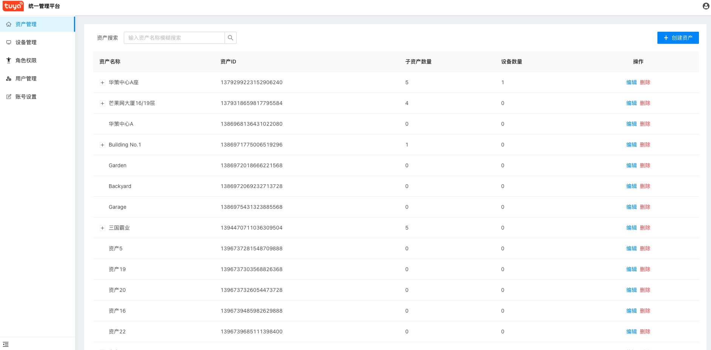
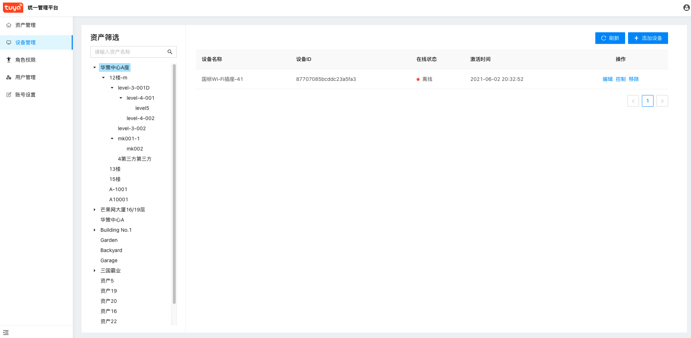
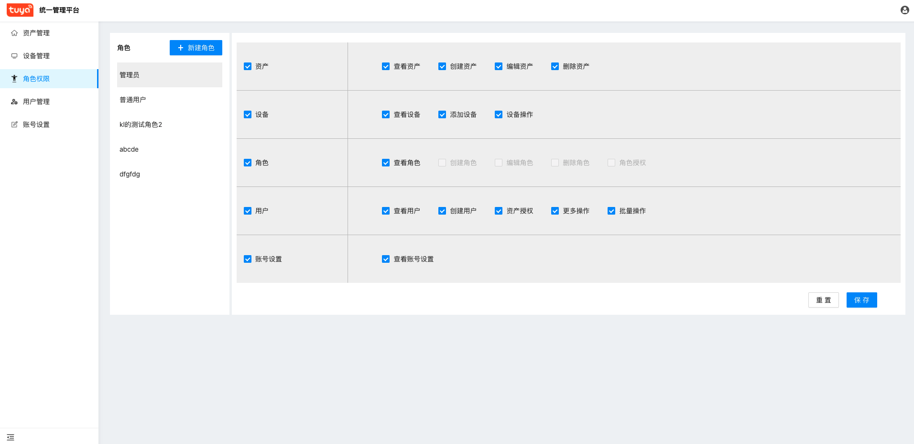
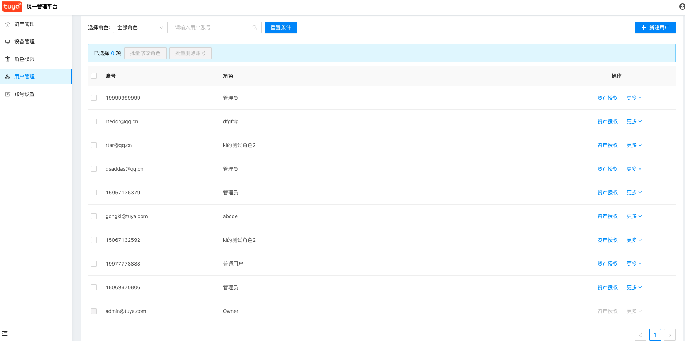

Tuya IoT Portal
===

[English](README.md) | [中文版](README_zh.md)

Tuya IoT Portal 是集成了设备、资产、角色、权限、账户等功能为一体的管理控制平台

## 说明文档

- [安装](./doc/Installation_zh.md)
- [部署](./doc/Deploy_zh.md)
- [Docker](./doc/Docker_zh.md)

## 预览

Tuya IoT Portal提供了基于涂鸦生态体系的基础管理应用，可以快速建立云开发平台功能扩展，提供的具体功能有：

用户可以自己定义资产结构。

可以查看资产下面的具体设备，并且可以为设备下发指令，并且可以通过移动端工具为设备配网，关联到相关资产下。

用户可以设置不同的角色，并且给每个角色分配不同的功能权限。

通过用户管理，可以修改用户的角色，和他们访问页面的数据权限（可以访问哪些资产以及设备）。

## Licenses

[MIT](./LICENSE)