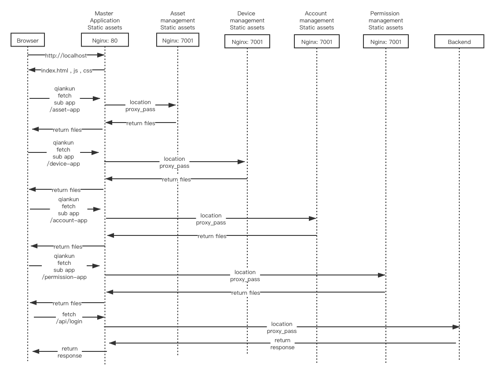

一级目录如下
```
.
├── LICENSE
├── README.md
├── README_zh.md
├── account-app  # 账户管理
│   ├── README.md
│   ├── dist
│   ├── package.json
│   ├── public
│   ├── src
│   ├── tsconfig.extend.json
│   ├── tsconfig.json
│   ├── typings.d.ts
│   └── yarn.lock
├── asset-app   # 资产管理
│   ├── README.md
│   ├── dist
│   ├── package.json
│   ├── public
│   ├── src
│   ├── tsconfig.extend.json
│   ├── tsconfig.json
│   ├── typings.d.ts
│   └── yarn.lock
├── bin  # 工具脚本
│   ├── build.js
│   ├── common.js
│   ├── install.js
│   └── sync.js
├── conf # 部署样例配置文件
│   ├── Dockerfile
│   └── nginx.conf
├── device-app # 设备管理
│   ├── README.md
│   ├── dist
│   ├── package.json
│   ├── public
│   ├── src
│   ├── tsconfig.extend.json
│   ├── tsconfig.json
│   ├── typings.d.ts
│   └── yarn.lock
├── dist # 构建结果集
│   ├── account-app
│   ├── asset-app
│   ├── device-app
│   ├── main-app
│   └── permission-app
├── doc # 文档
│   ├── Architecture.md
│   ├── Architecture_zh.md
│   ├── Deploy.md
│   ├── Deploy_zh.md
│   ├── Docker.md
│   ├── Docker_zh.md
│   ├── Installation.md
│   ├── Installation_zh.md
│   └── images
├── main-app # 主应用
│   ├── README.md
│   ├── dist
│   ├── package.json
│   ├── public
│   ├── src
│   ├── tsconfig.extend.json
│   ├── tsconfig.json
│   ├── typings.d.ts
│   └── yarn.lock
├── package.json
├── permission-app #角色权限管理
│   ├── README.md
│   ├── dist
│   ├── package.json
│   ├── public
│   ├── src
│   ├── tsconfig.extend.json
│   ├── tsconfig.json
│   ├── typings.d.ts
│   └── yarn.lock
└── yarn.lock
```


完整目录结构

<details>

```
.
├── LICENSE
├── README.md
├── README_zh.md
├── account-app
│   ├── README.md
│   ├── dist
│   │   ├── asset-manifest.json
│   │   ├── favicon.ico
│   │   ├── index.html
│   │   ├── robots.txt
│   │   └── static
│   │       ├── css
│   │       │   ├── 2.b4e56faa.chunk.css
│   │       │   ├── 2.b4e56faa.chunk.css.map
│   │       │   ├── main.d8981818.chunk.css
│   │       │   └── main.d8981818.chunk.css.map
│   │       └── js
│   │           ├── 2.befbabdb.chunk.js
│   │           ├── 2.befbabdb.chunk.js.LICENSE.txt
│   │           ├── main.8b16eb95.chunk.js
│   │           └── runtime-main.e0cb7573.js
│   ├── package.json
│   ├── public
│   │   ├── favicon.ico
│   │   ├── index.html
│   │   └── robots.txt
│   ├── src
│   │   ├── App.css
│   │   ├── App.tsx
│   │   ├── components
│   │   │   ├── BAddUser
│   │   │   │   ├── RegionSelect.tsx
│   │   │   │   ├── index.less
│   │   │   │   └── index.tsx
│   │   │   ├── BAssetTree
│   │   │   │   ├── index.less
│   │   │   │   ├── index.tsx
│   │   │   │   └── util.tsx
│   │   │   ├── BModalForm
│   │   │   │   └── index.tsx
│   │   │   ├── PAccount
│   │   │   │   ├── index.less
│   │   │   │   └── index.tsx
│   │   │   ├── YAddUser
│   │   │   │   └── AddUserFlow.tsx
│   │   │   ├── YAssetTree
│   │   │   │   ├── index.tsx
│   │   │   │   └── util.ts
│   │   │   ├── YEditUserName
│   │   │   │   └── EditUserName.tsx
│   │   │   ├── YModifyPwd
│   │   │   │   └── ModifyPwd.tsx
│   │   │   ├── YModifyRole
│   │   │   │   └── ModifyRole.tsx
│   │   │   ├── YRemoveAccount
│   │   │   │   └── RemoveAccount.tsx
│   │   │   ├── YRoleSelector
│   │   │   │   └── RoleSelector.tsx
│   │   │   └── index.tsx
│   │   ├── constant
│   │   │   └── index.ts
│   │   ├── global.d.ts
│   │   ├── hooks
│   │   │   └── index.ts
│   │   ├── index.css
│   │   ├── index.tsx
│   │   ├── init.ts
│   │   ├── lang
│   │   │   ├── en.ts
│   │   │   ├── index.ts
│   │   │   └── zh.ts
│   │   ├── pages
│   │   │   ├── index.less
│   │   │   └── index.tsx
│   │   ├── public-path.js
│   │   ├── react-app-env.d.ts
│   │   ├── reportWebVitals.ts
│   │   └── setupProxy.js
│   ├── tsconfig.extend.json
│   ├── tsconfig.json
│   ├── typings.d.ts
│   └── yarn.lock
├── asset-app
│   ├── README.md
│   ├── dist
│   │   ├── asset-manifest.json
│   │   ├── favicon.ico
│   │   ├── index.html
│   │   ├── robots.txt
│   │   └── static
│   │       ├── css
│   │       │   ├── 2.03710b91.chunk.css
│   │       │   ├── 2.03710b91.chunk.css.map
│   │       │   ├── main.cb450380.chunk.css
│   │       │   └── main.cb450380.chunk.css.map
│   │       └── js
│   │           ├── 2.c2bf21f9.chunk.js
│   │           ├── 2.c2bf21f9.chunk.js.LICENSE.txt
│   │           ├── main.3e446a62.chunk.js
│   │           └── runtime-main.76d89fdd.js
│   ├── package.json
│   ├── public
│   │   ├── favicon.ico
│   │   ├── index.html
│   │   └── robots.txt
│   ├── src
│   │   ├── App.css
│   │   ├── App.tsx
│   │   ├── components
│   │   │   ├── BAssetCascader
│   │   │   │   └── index.tsx
│   │   │   ├── BModalForm
│   │   │   │   └── index.tsx
│   │   │   ├── YAddAssetModal
│   │   │   │   └── index.tsx
│   │   │   ├── YAssetCascader
│   │   │   │   └── index.tsx
│   │   │   ├── YAssetSearch
│   │   │   │   ├── index.less
│   │   │   │   └── index.tsx
│   │   │   ├── YDelAssetModal
│   │   │   │   ├── index.less
│   │   │   │   └── index.tsx
│   │   │   ├── YEditAssetModal
│   │   │   │   └── index.tsx
│   │   │   └── index.tsx
│   │   ├── global.d.ts
│   │   ├── hooks
│   │   │   └── index.ts
│   │   ├── index.css
│   │   ├── index.tsx
│   │   ├── init.ts
│   │   ├── lang
│   │   │   ├── en.ts
│   │   │   ├── index.ts
│   │   │   └── zh.ts
│   │   ├── pages
│   │   │   ├── index.less
│   │   │   └── index.tsx
│   │   ├── public-path.js
│   │   ├── react-app-env.d.ts
│   │   ├── reportWebVitals.ts
│   │   └── setupProxy.ts
│   ├── tsconfig.extend.json
│   ├── tsconfig.json
│   ├── typings.d.ts
│   └── yarn.lock
├── bin
│   ├── build.js
│   ├── common.js
│   ├── install.js
│   └── sync.js
├── conf
│   ├── Dockerfile
│   └── nginx.conf
├── device-app
│   ├── README.md
│   ├── dist
│   │   ├── asset-manifest.json
│   │   ├── favicon.ico
│   │   ├── index.html
│   │   ├── qrcode-scan.png
│   │   ├── robots.txt
│   │   └── static
│   │       ├── css
│   │       │   ├── 2.03710b91.chunk.css
│   │       │   ├── 2.03710b91.chunk.css.map
│   │       │   ├── main.a5b7e9fa.chunk.css
│   │       │   └── main.a5b7e9fa.chunk.css.map
│   │       └── js
│   │           ├── 2.a5f056a8.chunk.js
│   │           ├── 2.a5f056a8.chunk.js.LICENSE.txt
│   │           ├── main.1ae8c88d.chunk.js
│   │           └── runtime-main.f8f0f99e.js
│   ├── package.json
│   ├── public
│   │   ├── favicon.ico
│   │   ├── index.html
│   │   ├── qrcode-scan.png
│   │   └── robots.txt
│   ├── src
│   │   ├── App.css
│   │   ├── App.tsx
│   │   ├── components
│   │   │   ├── BAssetCascader
│   │   │   │   └── index.tsx
│   │   │   ├── BAssetTree
│   │   │   │   ├── index.less
│   │   │   │   ├── index.tsx
│   │   │   │   └── util.tsx
│   │   │   ├── BDP
│   │   │   │   ├── Block
│   │   │   │   │   ├── index.less
│   │   │   │   │   └── index.tsx
│   │   │   │   ├── Default
│   │   │   │   │   └── index.tsx
│   │   │   │   ├── Input
│   │   │   │   │   └── index.tsx
│   │   │   │   ├── Select
│   │   │   │   │   └── index.tsx
│   │   │   │   ├── Slider
│   │   │   │   │   ├── index.less
│   │   │   │   │   └── index.tsx
│   │   │   │   └── Switcher
│   │   │   │       └── index.tsx
│   │   │   ├── BModalForm
│   │   │   │   └── index.tsx
│   │   │   ├── YAddDevice
│   │   │   │   ├── AddDeviceModal.tsx
│   │   │   │   └── index.tsx
│   │   │   ├── YAssetCascader
│   │   │   │   └── index.tsx
│   │   │   ├── YAssetTree
│   │   │   │   ├── index.tsx
│   │   │   │   └── util.ts
│   │   │   ├── YDelDeviceModal
│   │   │   │   ├── index.less
│   │   │   │   └── index.tsx
│   │   │   └── utils
│   │   │       └── index.ts
│   │   ├── global.d.ts
│   │   ├── hooks
│   │   │   └── index.ts
│   │   ├── index.css
│   │   ├── index.tsx
│   │   ├── init.ts
│   │   ├── lang
│   │   │   ├── en.ts
│   │   │   ├── index.ts
│   │   │   └── zh.ts
│   │   ├── pages
│   │   │   ├── components
│   │   │   │   ├── CtrlDP.tsx
│   │   │   │   ├── EditDevice.tsx
│   │   │   │   ├── Table.Device.tsx
│   │   │   │   ├── dp.test.ts
│   │   │   │   └── table.less
│   │   │   ├── index.less
│   │   │   └── index.tsx
│   │   ├── public-path.js
│   │   ├── react-app-env.d.ts
│   │   └── reportWebVitals.ts
│   ├── tsconfig.extend.json
│   ├── tsconfig.json
│   ├── typings.d.ts
│   └── yarn.lock
├── dist
│   ├── account-app
│   │   ├── asset-manifest.json
│   │   ├── favicon.ico
│   │   ├── index.html
│   │   ├── robots.txt
│   │   └── static
│   │       ├── css
│   │       │   ├── 2.b4e56faa.chunk.css
│   │       │   ├── 2.b4e56faa.chunk.css.map
│   │       │   ├── main.d8981818.chunk.css
│   │       │   └── main.d8981818.chunk.css.map
│   │       └── js
│   │           ├── 2.befbabdb.chunk.js
│   │           ├── 2.befbabdb.chunk.js.LICENSE.txt
│   │           ├── main.8b16eb95.chunk.js
│   │           └── runtime-main.e0cb7573.js
│   ├── asset-app
│   │   ├── asset-manifest.json
│   │   ├── favicon.ico
│   │   ├── index.html
│   │   ├── robots.txt
│   │   └── static
│   │       ├── css
│   │       │   ├── 2.03710b91.chunk.css
│   │       │   ├── 2.03710b91.chunk.css.map
│   │       │   ├── main.cb450380.chunk.css
│   │       │   └── main.cb450380.chunk.css.map
│   │       └── js
│   │           ├── 2.c2bf21f9.chunk.js
│   │           ├── 2.c2bf21f9.chunk.js.LICENSE.txt
│   │           ├── main.3e446a62.chunk.js
│   │           └── runtime-main.76d89fdd.js
│   ├── device-app
│   │   ├── asset-manifest.json
│   │   ├── favicon.ico
│   │   ├── index.html
│   │   ├── qrcode-scan.png
│   │   ├── robots.txt
│   │   └── static
│   │       ├── css
│   │       │   ├── 2.03710b91.chunk.css
│   │       │   ├── 2.03710b91.chunk.css.map
│   │       │   ├── main.a5b7e9fa.chunk.css
│   │       │   └── main.a5b7e9fa.chunk.css.map
│   │       └── js
│   │           ├── 2.a5f056a8.chunk.js
│   │           ├── 2.a5f056a8.chunk.js.LICENSE.txt
│   │           ├── main.1ae8c88d.chunk.js
│   │           └── runtime-main.f8f0f99e.js
│   ├── main-app
│   │   ├── asset-manifest.json
│   │   ├── favicon.ico
│   │   ├── imgs
│   │   │   └── device-app
│   │   │       └── qrcode-scan.png
│   │   ├── index.html
│   │   ├── robots.txt
│   │   └── static
│   │       ├── css
│   │       │   ├── 2.9117b9b2.chunk.css
│   │       │   ├── 2.9117b9b2.chunk.css.map
│   │       │   ├── main.0b73330d.chunk.css
│   │       │   └── main.0b73330d.chunk.css.map
│   │       ├── js
│   │       │   ├── 2.f8552758.chunk.js
│   │       │   ├── 2.f8552758.chunk.js.LICENSE.txt
│   │       │   ├── 3.103a224c.chunk.js
│   │       │   ├── main.f5794b80.chunk.js
│   │       │   └── runtime-main.537e45cc.js
│   │       └── media
│   │           └── login.8be9abf1.jpg
│   └── permission-app
│       ├── asset-manifest.json
│       ├── favicon.ico
│       ├── index.html
│       ├── robots.txt
│       └── static
│           ├── css
│           │   ├── 2.b4e56faa.chunk.css
│           │   ├── 2.b4e56faa.chunk.css.map
│           │   ├── main.11908ab3.chunk.css
│           │   └── main.11908ab3.chunk.css.map
│           └── js
│               ├── 2.dca45588.chunk.js
│               ├── 2.dca45588.chunk.js.LICENSE.txt
│               ├── main.99dcb523.chunk.js
│               └── runtime-main.37eafaac.js
├── doc
│   ├── Architecture.md
│   ├── Architecture_zh.md
│   ├── Deploy.md
│   ├── Deploy_zh.md
│   ├── Docker.md
│   ├── Docker_zh.md
│   ├── Installation.md
│   ├── Installation_zh.md
│   └── images
│       ├── build.png
│       ├── dist.png
│       ├── folder.png
│       ├── nginx-location.png
│       ├── nginx.conf.png
│       ├── pic01.png
│       ├── pic02.png
│       ├── pic03.png
│       ├── pic04.png
│       ├── tuya_logo.png
│       └── yarn_install.png
├── main-app
│   ├── README.md
│   ├── dist
│   │   ├── asset-manifest.json
│   │   ├── favicon.ico
│   │   ├── imgs
│   │   │   └── device-app
│   │   │       └── qrcode-scan.png
│   │   ├── index.html
│   │   ├── robots.txt
│   │   └── static
│   │       ├── css
│   │       │   ├── 2.9117b9b2.chunk.css
│   │       │   ├── 2.9117b9b2.chunk.css.map
│   │       │   ├── main.0b73330d.chunk.css
│   │       │   └── main.0b73330d.chunk.css.map
│   │       ├── js
│   │       │   ├── 2.f8552758.chunk.js
│   │       │   ├── 2.f8552758.chunk.js.LICENSE.txt
│   │       │   ├── 3.103a224c.chunk.js
│   │       │   ├── main.f5794b80.chunk.js
│   │       │   └── runtime-main.537e45cc.js
│   │       └── media
│   │           └── login.8be9abf1.jpg
│   ├── package.json
│   ├── public
│   │   ├── favicon.ico
│   │   ├── imgs
│   │   │   └── device-app
│   │   │       └── qrcode-scan.png
│   │   ├── index.html
│   │   └── robots.txt
│   ├── src
│   │   ├── App.css
│   │   ├── App.tsx
│   │   ├── components
│   │   │   ├── BHeaderUser
│   │   │   │   ├── account.png
│   │   │   │   ├── index.less
│   │   │   │   └── index.tsx
│   │   │   ├── BLayout
│   │   │   │   ├── account-icon.png
│   │   │   │   ├── assets-icon.png
│   │   │   │   ├── devices-icon.png
│   │   │   │   ├── index.tsx
│   │   │   │   ├── role-icon.png
│   │   │   │   ├── routers.tsx
│   │   │   │   ├── setting-icon.png
│   │   │   │   └── tuyalogo.png
│   │   │   ├── BLayoutLogin
│   │   │   │   ├── index.less
│   │   │   │   ├── index.tsx
│   │   │   │   └── login.jpg
│   │   │   ├── BLogin
│   │   │   │   ├── component
│   │   │   │   │   ├── EmailForm.tsx
│   │   │   │   │   ├── TeleForm.tsx
│   │   │   │   │   └── VerifyCode.tsx
│   │   │   │   ├── index.less
│   │   │   │   └── index.tsx
│   │   │   ├── BSwitchLang
│   │   │   │   └── index.tsx
│   │   │   ├── PLogin
│   │   │   │   ├── index.less
│   │   │   │   └── index.tsx
│   │   │   ├── PResetPwd
│   │   │   │   └── index.tsx
│   │   │   ├── PSetting
│   │   │   │   ├── index.less
│   │   │   │   └── index.tsx
│   │   │   └── index.tsx
│   │   ├── constant
│   │   │   ├── index.ts
│   │   │   └── permissionCode.ts
│   │   ├── hooks
│   │   │   └── index.ts
│   │   ├── index.css
│   │   ├── index.tsx
│   │   ├── init.ts
│   │   ├── lang
│   │   │   ├── en-US
│   │   │   │   ├── index.ts
│   │   │   │   ├── login.ts
│   │   │   │   ├── menu.ts
│   │   │   │   └── setting.ts
│   │   │   ├── index.ts
│   │   │   └── zh-CN
│   │   │       ├── index.ts
│   │   │       ├── login.ts
│   │   │       ├── menu.ts
│   │   │       └── setting.ts
│   │   ├── pages
│   │   │   ├── 403.tsx
│   │   │   ├── home
│   │   │   │   ├── index.tsx
│   │   │   │   └── setting
│   │   │   │       └── index.tsx
│   │   │   ├── index.ts
│   │   │   ├── login
│   │   │   │   └── index.tsx
│   │   │   └── resetPwd
│   │   │       └── index.tsx
│   │   ├── qiankun
│   │   │   ├── config.ts
│   │   │   ├── globalState.ts
│   │   │   └── index.ts
│   │   ├── react-app-env.d.ts
│   │   ├── reportWebVitals.ts
│   │   ├── setupProxy.js
│   │   └── utils
│   │       └── index.ts
│   ├── tsconfig.extend.json
│   ├── tsconfig.json
│   ├── typings.d.ts
│   └── yarn.lock
├── package.json
├── permission-app
│   ├── README.md
│   ├── dist
│   │   ├── asset-manifest.json
│   │   ├── favicon.ico
│   │   ├── index.html
│   │   ├── robots.txt
│   │   └── static
│   │       ├── css
│   │       │   ├── 2.b4e56faa.chunk.css
│   │       │   ├── 2.b4e56faa.chunk.css.map
│   │       │   ├── main.11908ab3.chunk.css
│   │       │   └── main.11908ab3.chunk.css.map
│   │       └── js
│   │           ├── 2.dca45588.chunk.js
│   │           ├── 2.dca45588.chunk.js.LICENSE.txt
│   │           ├── main.99dcb523.chunk.js
│   │           └── runtime-main.37eafaac.js
│   ├── package.json
│   ├── public
│   │   ├── favicon.ico
│   │   ├── index.html
│   │   └── robots.txt
│   ├── src
│   │   ├── App.css
│   │   ├── App.tsx
│   │   ├── components
│   │   │   ├── BModalForm
│   │   │   │   └── index.tsx
│   │   │   ├── BRoleListItem
│   │   │   │   └── index.tsx
│   │   │   ├── PPermission
│   │   │   │   ├── index.less
│   │   │   │   └── index.tsx
│   │   │   ├── YAddRole
│   │   │   │   └── index.tsx
│   │   │   ├── YPermissionTable
│   │   │   │   ├── index.less
│   │   │   │   ├── index.tsx
│   │   │   │   └── utils.ts
│   │   │   ├── YRemoveRole
│   │   │   │   └── index.tsx
│   │   │   └── YRoleList
│   │   │       ├── index.less
│   │   │       └── index.tsx
│   │   ├── constant
│   │   │   └── index.ts
│   │   ├── global.d.ts
│   │   ├── hooks
│   │   │   └── index.ts
│   │   ├── index.css
│   │   ├── index.tsx
│   │   ├── init.ts
│   │   ├── lang
│   │   │   ├── en.ts
│   │   │   ├── index.ts
│   │   │   └── zh.ts
│   │   ├── pages
│   │   │   ├── index.less
│   │   │   └── index.tsx
│   │   ├── public-path.js
│   │   ├── react-app-env.d.ts
│   │   ├── reportWebVitals.ts
│   │   └── setupProxy.js
│   ├── tsconfig.extend.json
│   ├── tsconfig.json
│   ├── typings.d.ts
│   └── yarn.lock
└── yarn.lock

149 directories, 391 files
```

</details>


### 部署说明

微前端架构可以独立部署基座应用和子应用，目前默认情况下使用单域名+多目录结构区分应用

