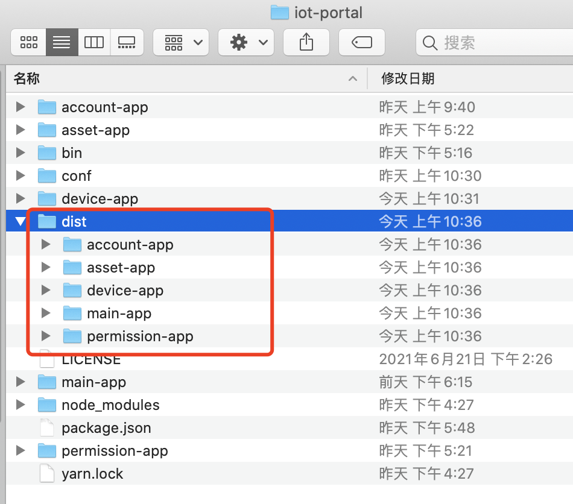
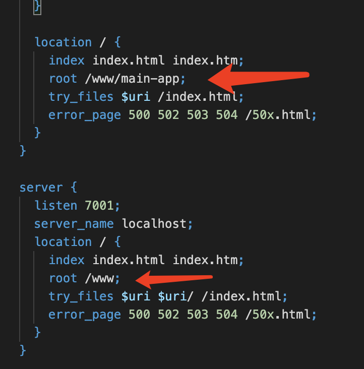
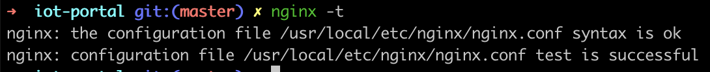

# 部署

### 前置说明

本项目依赖 `qiankun` 框架提供的微前端能力，如有其他部署需求，请移步 `qiankun` 官网查看 [qiankun部署说明](https://qiankun.umijs.org/zh/cookbook#%E5%A6%82%E4%BD%95%E9%83%A8%E7%BD%B2)

后端项目地址 [iot-suite-server](https://github.com/tuya/iot-suite-server)

### 部署

本项目采用的是前后端分离模式，所以前端可以理解为是静态文件集合

#### 1. 应用构建结果提取

每个子应用都是一个独立的项目，独立运行和部署，这一步是将这些独立应用聚合到一起

在项目根目录，打开命令行工具，运行构建结果集同步命令
```
npm run sync
```
运行完成后，会将所有项目已有的构建结果同步到项目根目录中

---

如果项目还没有编译，请运行如下命令，编译所有项目，并将结果集同步到根目录中
```
npm run build
```

完成上述命令，会得到如下结果


#### 2. 修改 `Nginx` 配置

项目中已提供 nginx.conf 样例，具体请参考 conf/nginx.conf

请将下图标红的位置改为自己项目部署的位置


例如：
项目构建结果集目录是 /www/iot-portal/dist

nginx.conf
```
server {
  listen 80;
  server_name localhost;

  location /health {
    default_type text/plain;
    return 200 "ok\n";
  }

  location ^~ /api/ {
    proxy_pass http://127.0.0.1:8080/;  # 后端服务地址
  }

  location ^~ /asset-app {
    proxy_pass http://127.0.0.1:7001;
  }

  location ^~ /device-app {
    proxy_pass http://127.0.0.1:7001;
  }

  location ^~ /permission-app {
    proxy_pass http://127.0.0.1:7001;
  }

  location ^~ /account-app {
    proxy_pass http://127.0.0.1:7001;
  }

  location / {
    index index.html index.htm;
    root /www/iot-portal/dist/main-app;  # 主应用所在目录
    try_files $uri /index.html;
    error_page 500 502 503 504 /50x.html;
  }
}

server {
  listen 7001;
  server_name localhost;
  location / {
    index index.html index.htm;
    root /www/iot-portal/dist;  # 项目所在目录
    try_files $uri $uri/ /index.html;
    error_page 500 502 503 504 /50x.html;
  }
}

```
请参考示例，替换为自己的运行目录

> 补充说明，api调用的地址需要根据后端部署情况决定，默认后端在本地 8080 端口提供服务


#### 3. 生效 `Nginx` 配置

第二步操作的nginx配置，还没有被nginx主程序加载，为了生效此配置，需将第二步的配置文件引入到nginx主配置中

打开命令行
1. 启动Nginx，如已启动nginx，忽略此步
```
nginx
```
2. 确定nginx默认配置位置
```
nginx -t
```

如图所示，本机的nginx配置为/usr/local/etc/nginx/nginx.conf

编辑此文件，在文件的最后一个大括号前增加如下配置，并保存配置
```
include /www/iot-portal/conf/nginx.conf;
```
然后，检查nginx配置是否正确
```
nginx -t
```
一切正确，会得到如下图片


最后一步，重启nginx，使配置生效
```
nginx -s reload
```

#### 4. 检查部署效果
启动浏览器，打开 http://localhost/ 查看部署效果
