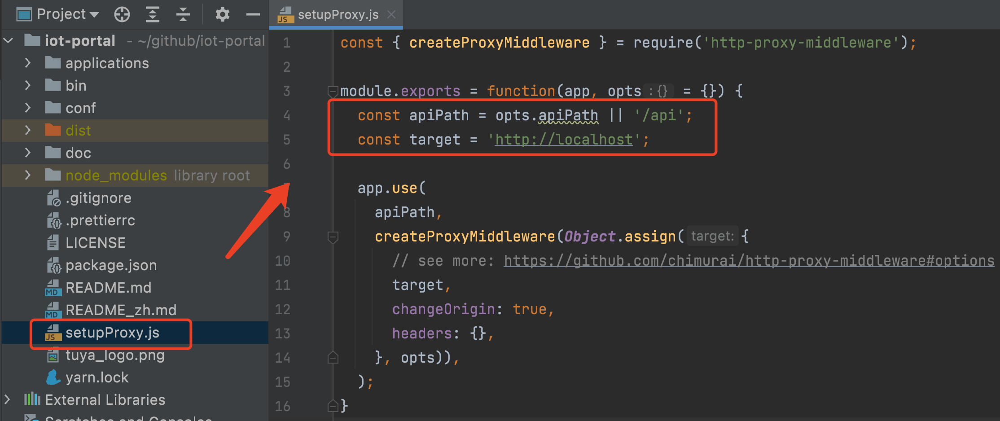
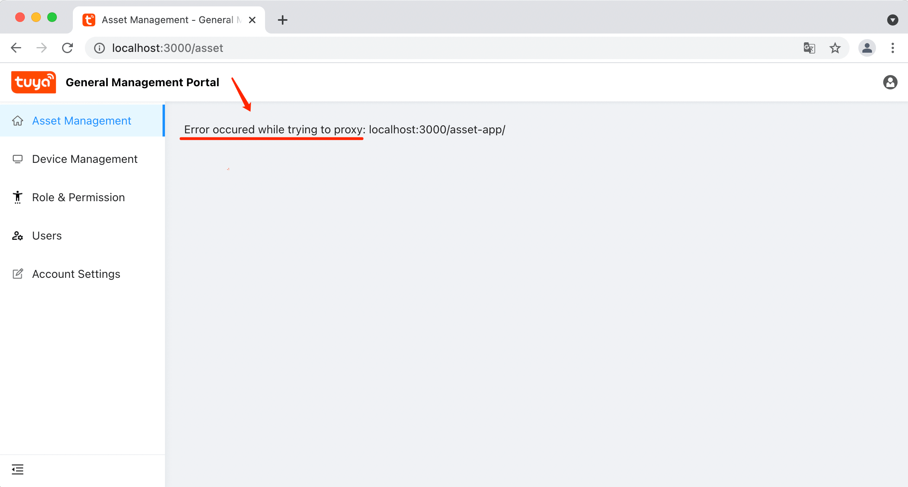
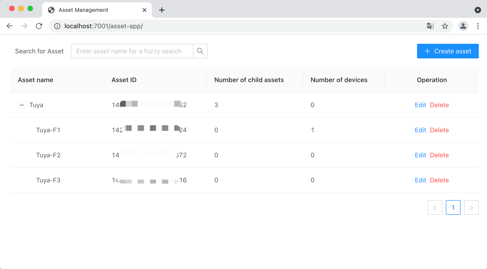

# Quick start

This article will introduce how to configure and run the front-end project of the SaaS development framework locally, and you can conduct secondary business development based on this.

This article is divided into two parts, `Quick Experience` and `Development & Debugging`, which respectively introduce how to install and start the project and how to carry out secondary development.

## Environment dependency
- [Node.js ≥ 12.0.0](https://nodejs.org/en/) (It is recommended to install the LTS version)
- [Yarn](https://yarnpkg.com/)
  - Install CLI: `npm i yarn -g`
- [Git](https://git-scm.com/)
- [Docker](https://www.docker.com) (Optional, used to build image)

## Quick experience
### Step 1: Start the interface service

The front-end project of the SaaS development framework requires the server to provide interface services. We provide the following two ways to start the interface services:

  - Method 1: [Run SaaS Development Framework Backend Project in Local Mode](https://developer.tuya.com/en/docs/iot/SaaSDevelopmentFramework_backend?id=Kaqcx9hwc9i62)

  - Method 2: [Run SaaS Development Framework Docker](https://developer.tuya.com/en/docs/iot/SaaSDevelopmentFramework_Image?id=Kapsg7pttb8f2) 
 
**💬 Description:**

  - If you just want to experience the development and debugging process of this project, it is recommended to use "Method 2" to start the interface service

  - The default interface service address is `http://localhost`, you can modify the configuration in [./setupProxy.js#L5](./setupProxy.js#L5) according to the actual situation

### Step 2: Installation

```bash
# Clone project
git clone git@github.com:tuya/iot-portal.git

# Jump to the directory where the project is located
cd ./iot-portal

# Use yarn to install dependencies
yarn
```

### Step 3: Compile the front-end project

```bash
# Use yarn to compile
yarn run build
```

The compiled file is as follows:

> 

### Step 4: Start the http service

```bash
# Use yarn to start the service
yarn run start
```

At this point, the startup of the project is completed. The service listens to the port `8888` by default. Enter [http://localhost:8888](http://localhost:8888) in the browser to access it normally.

Next we look at how to debug and develop sub-applications.

## Development & Debug

The SaaS development framework uses a micro-front-end architecture. Each micro-front-end application is an independent project and needs to be configured with independent dependencies, and each micro-front-end application can be independently deployed and run independently. This article takes debugging [`./applications/asset-app`](./applications/asset-app) (account management sub-application) as an example to introduce you the development & debugging process.

### Step 1: Start the interface service

In order to reduce the difficulty of debugging, we use [Run SaaS Development Framework Docker](https://developer.tuya.com/en/docs/iot/SaaSDevelopmentFramework_Image?id=Kapsg7pttb8f2) to start the interface service.

After the interface service is started successfully, make sure that [`./setupProxy.js#L5`](./setupProxy.js#L5) is configured with the correct service address.

> 


### Step 2: Start the main application

```bash
# Enter the main application
cd ./applications/main-app

# Start the main application
yarn run start
```

After the startup is complete, it will open the login page [http://localhost:3000/login](http://localhost:3000/login) by default, as shown in the figure below. The default initialized account of the Docker service is:

- Account：admin@tuya.com
- Password：Admin123456

> 

After the login is successful, it will jump to the [http://localhost:3000/asset](http://localhost:3000/asset) page, but since we have not started the `./applications/asset-app` sub-application, so You will see the following error message.

> 

Next, we start to start the `./applications/asset-app` sub-application


### Step 3: Launch the sub-application

Open a new command line window to start the sub-application, the process is similar to launching main application.

```bash
# Enter the sub-application that needs to be debugged
cd ./applications/asset-app

# Launch sub-application
yarn run start
```

After the service is started, enter [http://localhost:7001/asset-app/](http://localhost:7001/asset-app/) in the browser to access the sub-application, as shown below:

> 

**💬 Description:**

 - Because we deploy sub-applications in the form of sub-directories, there will be a `/asset-app` path in the url address.  

 - you can also modify the `7001` port of the sub-application in `./applications/asset-app/.env`.

After that, Go back and refresh the address of the main application just now [http://localhost:3000/asset](http://localhost:3000/asset), you can see the following interface:

> 

At this point, we have completed the startup of the nested debugging service of "main application + sub-application" ✌🏻 .


## Micro front end configuration instructions

The SaaS development framework is the basic [qiankun](https://qiankun.umijs.org/zh) implementation. The base application of the micro front end is `main-app`, and all sub-applications rely on the base application to load. The specific Configuration location [`./applications/main-app/src/qiankun`](./applications/main-app/src/qiankun)

