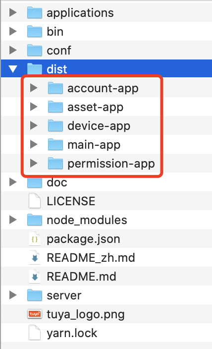
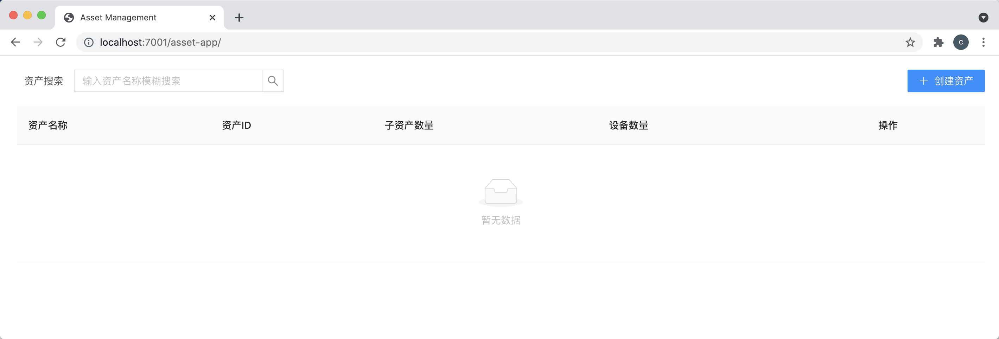
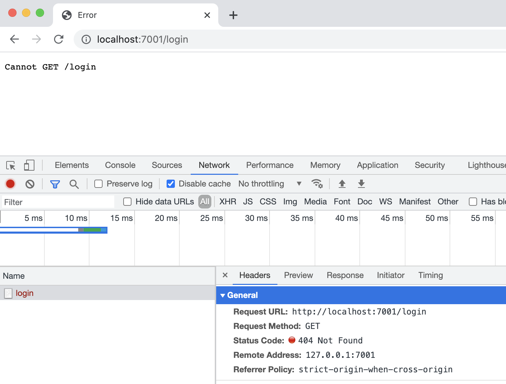

# 快速开始

本文将介绍如何在本地配置运行 SaaS 开发框架的前端项目，基于此您可以进行二次开发自己业务。

本文分为`安装运行`和`调试`两部分，分别介绍如何安装和启动项目以及如何本地二次开发。


## 环境依赖
- [Node.js ≥ 12.0.0](https://nodejs.org/en/) （建议安装 LTS 版本）
- [Yarn](https://yarnpkg.com/) （可选）
- [Git](https://git-scm.com/)
- [Docker](https://www.docker.com) （可选，用于构建镜像）

## 安装运行
### 步骤 1：启动接口服务

SaaS 开发框架的前端项目需要服务端提供接口服务，我们提供以下两种方式启动接口服务：

  1. [本地运行 SaaS 开发框架后端项目](https://developer.tuya.com/cn/docs/iot/SaaSDevelopmentFramework_backend?id=Kaqcx9hwc9i62)

  2. [运行 SaaS 开发框架 Docker 镜像](https://developer.tuya.com/cn/docs/iot/SaaSDevelopmentFramework_Image?id=Kapsg7pttb8f2) 
 
**💬 说明：**

  - 如果仅仅是想体验本项目的开发、调试流程，建议使用「方法 2」启动接口服务

  - 默认接口服务地址为 `http://localhost`，需要根据实际情况修改 [./bin/server.js#L13](./bin/server.js#L13) 配置

### 步骤 2：安装

```bash
# 克隆项目
git clone git@github.com:tuya/iot-portal.git

# 跳转到项目所在目录
cd ./iot-portal

# 使用 yarn 安装依赖
yarn

# 或者使用 npm 安装依赖
npm install
```

### 步骤 3：编译前端项目

```bash
# 使用 yarn 编译
yarn run build

# 或者使用 npm 编译
npm run build
```

编译后的文件如下：
> 

### 步骤 4：启动 http 服务

```bash
# 使用 yarn 启动服务
yarn run start

# 或者使用 npm 启动服务
npm run start
```

至此，就完成了项目的启动，服务默认监听 `8888` 端口，在浏览器中输入 [http://localhost:8888](http://localhost:8888) 就能正常访问。

接下来我们看一下如何调试和开发子应用。


## 调试服务

SaaS 开发框架采用的是微前端的架构，每个微前端应用均为独立项目，需要配置独立的依赖，且每个微前端应用均可独立部署独立运行。本文以调试 [`./applications/asset-app`](./applications/asset-app)（账户管理子应用） 为例为您介绍调试流程。

### 步骤 1：启动接口服务

为了降低调试难度，我们使用 [运行 SaaS 开发框架 Docker 镜像](https://developer.tuya.com/cn/docs/iot/SaaSDevelopmentFramework_Image?id=Kapsg7pttb8f2) 启动接口服务。

在接口服务启动成功后，确保 [`./setupProxy.js#L5`](./setupProxy.js#L5) 配置了正确的服务地址


### 步骤 2：启动子应用

```bash
# 进入需要调试的子应用
cd ./applications/asset-app

# 启动子应用
yarn run start

# 或者使用 npm 启动子应用
npm run start
```

> 服务启动后，在浏览器中输入 [http://localhost:7001/asset-app/](http://localhost:7001/asset-app/) 就能访问该子应用。
> 
> 因为我们使用子目录的形式部署子应用，所以 url 地址里会有 `/asset-app` 路径存在。
> 
> 另外，你也可以在 `./applications/asset-app/.env` 中修改 `7001` 端口。

#### 场景 1：在接口服务还未启动时

完成编译流程后，我可以在浏览器中看到如下界面

> 

#### 场景 2：在接口服务启动正常时

在完成编译流程后，会自动跳到 `http://localhost:7001/login` ，这是因为接口请求不包含登录信息，后端服务收到请求后会抛异常出来，前端服务在收到异常后，发现是登录态失效，就会跳转到 `/login`，需要用户重新登陆

> 

但我们的子应用不提供登陆功能，现在，我们再将视角转回到主应用


### 步骤 3：启动主应用

打开一个新的命令行窗口启动主应用，该过程与启动子应用类似

```bash
# 进入主应用
cd ./applications/main-app

# 启动主应用
yarn run start

# 或者使用 npm 启动主应用
npm run start
```

启动完成，默认会来到登陆页面 [http://localhost:3000/login](http://localhost:3000/login) ，如下图所示。Docker服务默认初始化的账户是：

 - 账号：admin@tuya.com
 - 密码：Admin123456

> 


登陆成功后就可以进入到 `asset-app`

> 

至此，我们完成了「主应用 + 子应用」的嵌套调试服务的启动


## 微前端配置说明

SaaS开发框架是基础 [qiankun](https://qiankun.umijs.org/zh) 实现，微前端的基座应用是 `main-app`，所有的子应用全部依赖基座应用来加载，具体的配置位置 [`./applications/main-app/src/qiankun`](./applications/main-app/src/qiankun)

